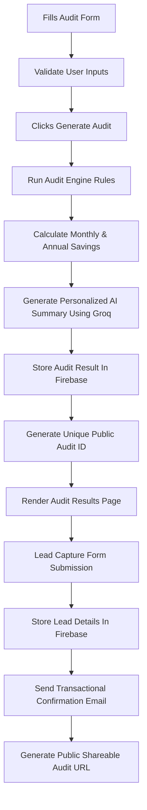

# Mermaid Diagram

---
# Data Flow

1. User fills the AI spend audit form with:
   - Tool name
   - Current plan
   - Monthly spend
   - Seats
   - Team size
   - Primary use case

2. Form validation checks:
   - Empty fields
   - Invalid numbers
   - Missing tool selections

3. After clicking "Generate Audit":
   - The audit engine processes the submitted data
   - Hardcoded pricing rules compare the selected plans against better-fit plans

4. The system calculates:
   - Current monthly spend
   - Optimized monthly spend
   - Monthly savings
   - Annual savings
   - Recommended actions

5. A personalized AI summary is generated using the Groq API.

6. The complete audit result is stored in Firebase with:
   - Unique audit ID
   - Timestamp
   - Audit results
   - Shareable public data

7. The result page renders:
   - Hero savings section
   - Per-tool breakdown
   - AI summary
   - Lead capture form
   - Shareable audit link

8. When a lead submits their email:
   - Lead details are stored in Firebase
   - A transactional confirmation email is sent
   - After lead capture show shearable link section

# Why I Chose This Stack

## Next.js
I chose Next.js because it provides fast page rendering, simple routing, and easy deployment on Vercel. It also supports both frontend and backend features in one project structure.

## TypeScript
I have used typescript because here argument type is already defined which makes easy for bug detection and finding

## Next.js

Now in modern days NextJs is used and it will provide certain benefits as well easy routing , provide overall performance optimization , no need of seperate server setup , good for SEO

##  Firebase 

I have used Firebase because there is no server setup complexity , easy queries ,good for fast fetching or storing and good for small projects.

## Tailwind CSS 

I have used Tailwind CSS because with help of this we can build a clean UI quickly without writing large amounts of custom CSS.

##  Nodemailer 

Used Nodemailer for transactional emails instead of paid email services.I have also used this because my earlier personal projects i have used nodemailer.

## Groq API
I used Groq API for AI-generated summaries because it provides fast response for lightweight LLM tasks.

# What I Would Change For 10k Audits Per Day

## Move AI Generation To Backend Queue
Currently the Groq summary generation happens directly during audit generation. For high traffic, I would move this to a background queue system using Redis + BullMQ or serverless queues to prevent blocking requests.

## Add Rate Limiting
I would implement stronger abuse protection using:
- IP-based rate limiting
- CAPTCHA
- API throttling
- Firebase App Check

## Use Server-Side API Routes
Sensitive operations like:
- AI API calls
- Email sending
- Lead storage

would move fully to secure backend API routes instead of frontend-triggered requests.

## Introduce Database Indexing
Firestore indexes would be optimized for:
- Audit retrieval
- Lead filtering
- Analytics queries
- High-savings user segmentation

## Add Caching Layer
Popular public audit pages would be cached using:
- Vercel Edge Cache
- Redis
- CDN caching

to reduce Firebase reads.

## Add Analytics & Monitoring
I would integrate:
- PostHog
- Sentry
- Google Analytics
- Log monitoring

to track failures, drop-offs, API latency, and user behavior.

## Separate Services
The app would eventually split into:
- Frontend service
- Audit engine service
- AI summary service
- Email service
- Analytics service

to improve scalability and maintainability.

## Improve Security
For production-scale traffic:
- API keys would move fully server-side
- Public audit data would be sanitized more strictly
- Email abuse checks would be stronger
- Authentication could be added for enterprise users